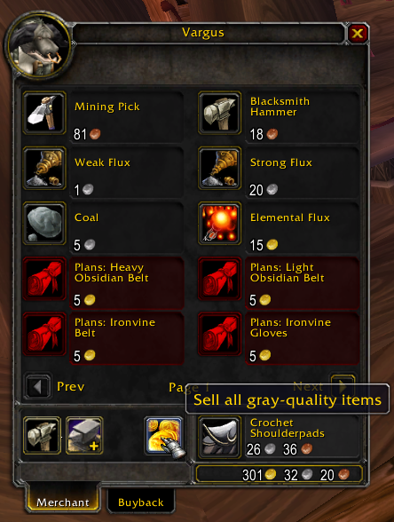
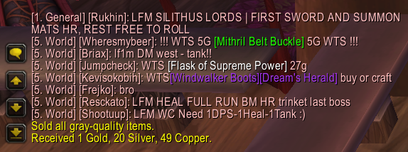

# Sell All Grays

`Sell All Grays` is a lightweight addon for vanilla World of Warcraft 1.12.1 that adds a one-click button to the merchant window for selling all gray (poor-quality) items in your bags.

## Features

- Adds a coin-icon sell button to the merchant frame.
- Sells all poor-quality items from bags 0-4 with one click.
- Skips locked bag slots.
- Shows the button only when gray items are available.
- Prints the total money gained after a sell action.

## Requirements

- **Game:** World of Warcraft 1.12.1
- **Interface:** `11200`

## Installation

1. Download or clone this repository.
2. Place this folder inside your vanilla World of Warcraft addons directory:

   ```
   World of Warcraft/Interface/AddOns/Forged_SellAllGrays
   ```

3. Confirm the folder contains at least:
   - `Forged_SellAllGrays.toc`
   - `core.lua`
   - `item_utils.lua`
   - `money.lua`
   - `ui.lua`
4. Start the game and enable the addon from the AddOns list at character select.

## Usage

1. Open a merchant (vendor) window.
2. Find the coin button near the repair buttons.
3. Click it once to sell all poor-quality items.
4. Check chat for the sale confirmation and total money received.

## Screenshots





## Behavior Notes

- The sell button appears only while a merchant window is open.
- The addon hides `MerchantRepairText` and repositions repair buttons to make space.
- The sell button updates visibility on merchant and bag updates.
- Money gained is printed in Gold/Silver/Copper format.

## Troubleshooting

- **Button does not appear:** Make sure you are at a merchant and have at least one gray item in your bags.
- **Addon not listed in-game:** Verify folder name/path under `Interface/AddOns` and that `.toc`/`.lua` files are directly inside the addon folder.
- **No money message shown:** No coin gain was detected (for example, no gray items were sold).
- **Lua errors on startup or at merchants:** Confirm you are running the addon on a vanilla 1.12.1 client with interface `11200`.

## License

No license file is currently included in this repository.
